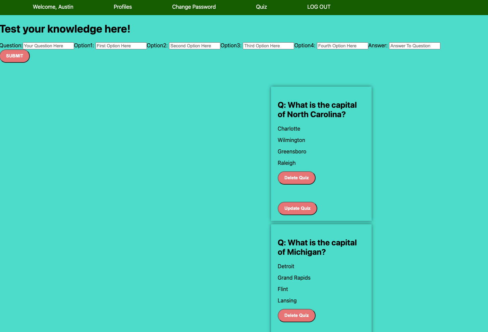

# iStudy

📌 iStudy is designed for anyone who loves testing their knowledge in a fun and engaging way. It features the ability to make quizzes on a wide range of topics, from Geography and science to pop culture and sports. iStudy allows users to tailor their quiz-taking experience to their interests and preferences. Simply click the card to reveal the answer.

## ➡️ [Check Out iStudy For Yourself](https://i-study.netlify.app/quizzes)

## [Check Out iStudy Back End](https://github.com/aafrieso/i-study-back-end)

## Technologies Used 💻

[React](https://img.shields.io/badge/react-%2320232a.svg?style=for-the-badge&logo=react&logoColor=%2361DAFB)

## Credits 📫

* Netlify and Fly.io are used for the deployment of this application
* Favicon drawn using faviconer.com
* Markdown badges from GitHub
* Apple Fonts

## Ice Box 🧊

* Random question selection: Allow users to select a category or difficulty level, and generate a set of random questions from that category or difficulty level.
* Quiz timer: Add a timer to the quiz to keep track of how long it takes the user to come up with the answer.
* Add ability to separate quizzes made for different subjects.
